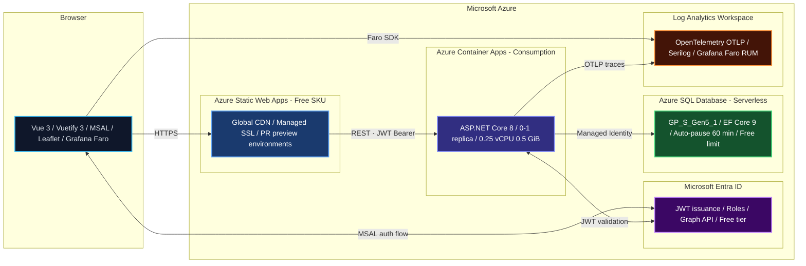

CCDiary is a personal diary app — role-based access, map support, archive exports, the works. The interesting constraint: it should cost nothing to run in a low-traffic personal context. This article is the entry point to a series covering the build in detail. Here's how all the pieces fit together and why each technology was chosen.

## The Goal

The app needs to:

- Store diary entries securely behind authenticated access
- Support multiple roles (admin, contributor, viewer)
- Run indefinitely without a standing monthly bill
- Be deployable repeatably from code

The "free" requirement ruled out always-on compute and drove almost every infrastructure decision that followed.

## Architecture at a Glance

## How It Stays Free

Azure's free tiers are generous, but only if you design for them intentionally. Three decisions carry the weight here.

### Azure Container Apps — Consumption Plan

Container Apps on the consumption plan bills per-request and per-vCPU-second. There is no charge when no requests are in flight. At personal-diary scale — a handful of sessions a day — the monthly compute cost rounds to zero. The API is configured at 0.25 vCPU / 0.5 GiB memory and scales between zero and one replica, so idle time is genuinely free.

### Azure SQL Database — Serverless with Free Limit

The database is provisioned as serverless (`GP_S_Gen5_1`) with auto-pause set to 60 minutes. After an hour of inactivity the database suspends itself; the next connection wakes it in a few seconds. On top of that, `useFreeLimit: true` applies Azure SQL's free tier allowance (100,000 vCore-seconds and 32 GB storage per month). `freeLimitExhaustionBehavior: AutoPause` ensures that if the free limit is ever reached the database pauses rather than running up a bill.

### Azure Static Web Apps — Free SKU

The SPA is served from Static Web Apps on the free SKU. This gives global CDN distribution, managed SSL, custom domains, and preview deployments per pull request — at no cost.

### Everything Together

| Service | SKU / Plan | Why it's free |
|---|---|---|
| Static Web Apps | Free | Free SKU tier |
| Container Apps | Consumption | Pay-per-request; zero-scale |
| SQL Database | Serverless | Auto-pause + free limit |
| Log Analytics | Pay-as-you-go | Minimal ingestion at personal scale |
| Entra ID | Free tier | External identities, no P1/P2 needed |

## Infrastructure as Code

All resources are defined in Bicep and deployed from the `/deploy` directory:

- `main.bicep` — subscription-level orchestration
- `resourceGroup.bicep` — resource group and shared resources
- `containerApps.bicep` — the Container Apps environment and the API app

Bicep was chosen over Terraform for this project because it's Azure-native, has first-class ARM type coverage, and has zero external tooling to install in CI. The deployment is idempotent — running it again on existing resources updates them in place.

## The API

The backend is ASP.NET Core 8 running in a Linux container, built with .NET 8 and pushed to the GitHub Container Registry (GHCR) on each release.

**Authentication and authorisation** use Microsoft Identity Web and Entra ID JWT Bearer tokens. Three roles gate access:

- `DiaryAdmin` — full access, user management
- `DiaryContributor` — create and edit entries
- `DiaryViewer` — read-only

SQL authentication is disabled at the server level; the API connects to the database using a managed identity, so no connection string credentials exist anywhere.

**Data access** is Entity Framework Core 9 with SQL Server. Migrations run as a separate step in CI before the new container image is rolled out, keeping schema and application in sync without downtime coupling.

**Observability** is OpenTelemetry throughout — ASP.NET Core instrumentation, SqlClient spans, and outbound HTTP traces all exported to Log Analytics via the OTLP exporter. Serilog handles structured logging. Steeltoe adds `/health` endpoints for the Container Apps liveness and readiness probes.

**Noteworthy controllers:**

| Controller | Responsibility |
|---|---|
| DiaryController | CRUD for diary entries |
| UserController | Profile and preferences |
| AccessRequestController | Request and approve access |
| AdminController | User and role management |
| MapTileController | Proxy for map tile requests |
| DiaryArchiveController | Export and import |
| AppInfoController | Version and config metadata |

## The UI

The frontend is Vue 3 with Vite, written in TypeScript.

**Vuetify 3** provides the component library — a Material Design system with good out-of-the-box accessibility and a comprehensive set of data display components (data tables, timelines, dialogs) that suited a diary interface.

**MSAL Browser** (`@azure/msal-browser`) handles the Entra ID authentication flow in the SPA. It manages token acquisition, refresh, and caching without the app needing to touch credentials directly. The acquired JWT is attached to every API request.

**Vue Router** handles client-side navigation; **Pinia** manages global state (the current user, active diary, etc.).

**Leaflet** renders maps for diary entries with location data. Map tile requests are proxied through the API to avoid exposing third-party tile keys in the browser.

**Grafana Faro** instruments the frontend — errors, Web Vitals, and network traces — feeding the same Log Analytics workspace that the API writes to, giving a joined frontend-to-backend view in Grafana.

## CI/CD

GitHub Actions runs the full pipeline on every push and pull request:

1. **Semantic versioning** — a custom action derives the version from git tags
2. **API** — `dotnet build`, `dotnet test` with coverage, SonarCloud scan, Docker build and push to GHCR
3. **Database migration** — EF migration runner executes against the target environment before the new image goes live
4. **Container Apps deployment** — rolls the new image; health checks must pass before the job succeeds
5. **UI** — `npm ci`, ESLint, Vitest with coverage, SonarCloud scan, deploy to Static Web Apps
6. **E2E tests** — Playwright runs against the freshly-deployed preview environment
7. **Release** — GitHub release drafted with artifacts

Pull requests get a preview environment automatically via Static Web Apps' built-in staging support and a corresponding Entra ID redirect URI registered via the `entra-cleanup` workflow.

## What Comes Next

This overview is the entry point to a series that goes deeper on each layer:

- **Bicep deep dive** — parameterisation, modules, and how the free tier config is wired
- **Entra ID integration** — SPA auth flow, managed identity for the API, and role assignment
- **EF Core with serverless SQL** — migration strategy and handling cold-start latency
- **Container Apps zero-to-one scaling** — configuration, cold starts, and health probes
- **OpenTelemetry end-to-end** — joining frontend Faro traces with backend OTEL spans in Grafana

The source is on GitHub. Each article in the series links directly to the relevant files.
