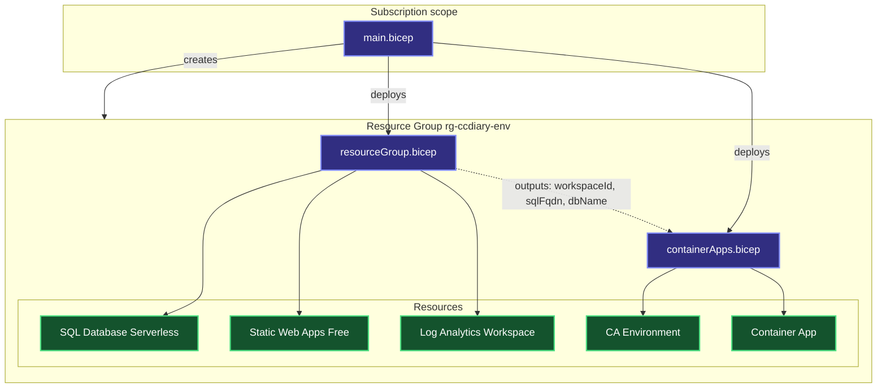

Part of the [CCDiary series](/articles/ccdiary/architecture-overview). The [architecture overview](/articles/ccdiary/architecture-overview) covers the full picture; this article goes deep on the infrastructure layer.

Bicep is Azure's native IaC language — compiled to ARM templates, first-class resource type coverage, and no external tooling to install in CI. For CCDiary the entire stack is defined in three files. One command deploys or updates everything idempotently. This article walks through the module structure, how outputs flow between modules, and the exact properties that wire up the free-tier behaviour.

## Module Structure

The `deploy/` directory has three Bicep files at two different ARM scopes:

```
deploy/
├── main.bicep            # subscription scope
├── resourceGroup.bicep   # resource group scope — SQL, SWA, Log Analytics
└── containerApps.bicep   # resource group scope — CA environment + API app
```

`main.bicep` runs at subscription scope so it can both create the resource group and deploy into it in a single command. Running at resource group scope would require the group to already exist — adding a manual step that breaks the one-command deploy goal.



## main.bicep — Subscription Scope

```bicep
targetScope = 'subscription'

@description('Azure region for all resources.')
param location string = 'uksouth'

@description('Environment name — appended to all resource names.')
@allowed(['dev', 'prod'])
param environment string

@description('Container image tag to deploy to the API.')
param apiImageTag string

@description('Object ID of the Entra ID group granted SQL admin.')
param sqlAdminGroupObjectId string

@description('Display name of the Entra ID SQL admin group.')
param sqlAdminGroupName string

var resourceGroupName = 'rg-ccdiary-${environment}'

resource rg 'Microsoft.Resources/resourceGroups@2023-07-01' = {
  name: resourceGroupName
  location: location
}

module core './resourceGroup.bicep' = {
  name: 'core-${environment}'
  scope: rg
  params: {
    location: location
    environment: environment
    sqlAdminGroupObjectId: sqlAdminGroupObjectId
    sqlAdminGroupName: sqlAdminGroupName
  }
}

module compute './containerApps.bicep' = {
  name: 'compute-${environment}'
  scope: rg
  dependsOn: [core]
  params: {
    location: location
    environment: environment
    apiImageTag: apiImageTag
    logAnalyticsWorkspaceId: core.outputs.logAnalyticsWorkspaceId
    logAnalyticsSharedKey: core.outputs.logAnalyticsSharedKey
    sqlServerFqdn: core.outputs.sqlServerFqdn
    sqlDatabaseName: core.outputs.sqlDatabaseName
  }
}
```

`dependsOn: [core]` forces sequential deployment. The Container Apps environment needs the Log Analytics workspace customer ID and shared key to wire up diagnostics, and those come from `core`'s outputs. Without `dependsOn`, ARM deploys both modules in parallel and the compute module fails when the workspace doesn't exist yet.

`sqlAdminGroupObjectId` and `sqlAdminGroupName` are passed in at deploy time (from CI secrets) rather than stored in the parameter file. They're sensitive enough that keeping them out of source control is worthwhile.

## resourceGroup.bicep — Core Resources

### Log Analytics Workspace

Everything in the stack writes logs and metrics here. It's the first resource deployed because everything else depends on it.

```bicep
resource logAnalyticsWorkspace 'Microsoft.OperationalInsights/workspaces@2023-09-01' = {
  name: 'law-ccdiary-${environment}'
  location: location
  properties: {
    sku: {
      name: 'PerGB2018'  // pay-as-you-go; free for low ingestion volumes
    }
    retentionInDays: 30
  }
}

output logAnalyticsWorkspaceId string = logAnalyticsWorkspace.id
output logAnalyticsSharedKey string = logAnalyticsWorkspace.listKeys().primarySharedKey
```

At personal-diary traffic levels the Log Analytics ingestion cost is effectively zero — the first 5 GB per month is free under the Basic tier.

### SQL Server — Entra-Only Authentication

SQL authentication is disabled at the server level. The API authenticates using a managed identity; no password exists anywhere.

```bicep
resource sqlServer 'Microsoft.Sql/servers@2023-05-01-preview' = {
  name: 'sql-ccdiary-${environment}'
  location: location
  properties: {
    administrators: {
      administratorType: 'ActiveDirectory'
      azureADOnlyAuthentication: true      // disables SQL logins entirely
      login: sqlAdminGroupName
      sid: sqlAdminGroupObjectId
      tenantId: subscription().tenantId
    }
    minimalTlsVersion: '1.2'
    publicNetworkAccess: 'Enabled'
  }
}
```

`azureADOnlyAuthentication: true` is the key line. Once set, no SQL login — not even `sa` — can connect. Every connection must present an Entra ID token.

### SQL Database — Serverless with Free Limit

```bicep
resource sqlDatabase 'Microsoft.Sql/servers/databases@2023-05-01-preview' = {
  parent: sqlServer
  name: 'ccdiary-${environment}'
  location: location
  sku: {
    name: 'GP_S_Gen5'
    tier: 'GeneralPurpose'
    family: 'Gen5'
    capacity: 1                  // 1 vCore max
  }
  properties: {
    maxSizeBytes: 34359738368    // 32 GiB — the free limit cap
    autoPauseDelay: 60           // pause after 60 minutes idle (minimum allowed)
    minCapacity: '0.5'           // floor when active, in vCores
    useFreeLimit: true           // enrol in free tier allowance
    freeLimitExhaustionBehavior: 'AutoPause'  // pause if limit hit, never bill
  }
}
```

Three properties carry the free-tier guarantee:

| Property | Value | Effect |
|---|---|---|
| `useFreeLimit` | `true` | Applies the 100,000 vCore-second monthly allowance |
| `freeLimitExhaustionBehavior` | `AutoPause` | Pauses instead of billing if the allowance is exhausted |
| `autoPauseDelay` | `60` | Suspends the database after 60 minutes of inactivity |

`autoPauseDelay` cannot be set below 60 minutes in the serverless tier. The next connection after a pause wakes the database; typical resume time is 20–30 seconds. See the [EF Core article](/articles/ccdiary/ef-core-serverless-sql) for how the API handles this latency.

### Static Web Apps — Free SKU

```bicep
resource swa 'Microsoft.Web/staticSites@2023-01-01' = {
  name: 'swa-ccdiary-${environment}'
  location: location
  sku: {
    name: 'Free'
    tier: 'Free'
  }
  properties: {
    stagingEnvironmentPolicy: 'Enabled'
    allowConfigFileUpdates: true
  }
}
```

`stagingEnvironmentPolicy: 'Enabled'` is required for PR preview deployments. The GitHub Actions Static Web Apps action creates a staging environment per pull request automatically; this property allows that.

The `Free` SKU includes global CDN, managed SSL, custom domains, and up to 3 staging environments. The `Standard` SKU adds custom authentication providers, private endpoints, and higher staging limits — none needed for CCDiary.

### Outputs

`resourceGroup.bicep` exposes the values that `containerApps.bicep` needs:

```bicep
output logAnalyticsWorkspaceId string = logAnalyticsWorkspace.id
output logAnalyticsSharedKey string = logAnalyticsWorkspace.listKeys().primarySharedKey
output sqlServerFqdn string = sqlServer.properties.fullyQualifiedDomainName
output sqlDatabaseName string = sqlDatabase.name
output swaDefaultHostname string = swa.properties.defaultHostname
```

Outputs are how Bicep modules compose. The parent module (`main.bicep`) receives these values and forwards them to `containerApps.bicep` as parameters.

## containerApps.bicep — Compute

### Container Apps Environment

The managed environment is the shared runtime layer — networking, KEDA, Dapr (unused here), and log forwarding.

```bicep
resource caEnvironment 'Microsoft.App/managedEnvironments@2023-11-02-preview' = {
  name: 'cae-ccdiary-${environment}'
  location: location
  properties: {
    appLogsConfiguration: {
      destination: 'log-analytics'
      logAnalyticsConfiguration: {
        customerId: logAnalyticsWorkspace.properties.customerId
        sharedKey: logAnalyticsSharedKey
      }
    }
  }
}
```

All container stdout/stderr goes to Log Analytics automatically via the `appLogsConfiguration` block — no additional SDK needed for basic log visibility.

### Container App — API

```bicep
resource apiApp 'Microsoft.App/containerApps@2023-11-02-preview' = {
  name: 'ca-ccdiary-api-${environment}'
  location: location
  identity: {
    type: 'SystemAssigned'    // managed identity — used for SQL and GHCR
  }
  properties: {
    environmentId: caEnvironment.id
    configuration: {
      ingress: {
        external: true
        targetPort: 8080
        transport: 'auto'
        corsPolicy: {
          allowedOrigins: allowedCorsOrigins
          allowedMethods: ['GET', 'POST', 'PUT', 'DELETE', 'OPTIONS']
          allowedHeaders: ['*']
          allowCredentials: true
        }
      }
      registries: [
        {
          server: 'ghcr.io'
          identity: 'system'   // pull images from GHCR using managed identity
        }
      ]
    }
    template: {
      containers: [
        {
          name: 'api'
          image: 'ghcr.io/sinclapa/ccdiary-api:${apiImageTag}'
          resources: {
            cpu: '0.25'
            memory: '0.5Gi'
          }
          env: [
            {
              name: 'ASPNETCORE_ENVIRONMENT'
              value: environment == 'prod' ? 'Production' : 'Development'
            }
            {
              name: 'ConnectionStrings__DefaultConnection'
              value: 'Server=${sqlServerFqdn};Database=${sqlDatabaseName};Authentication=Active Directory Managed Identity;Encrypt=True'
            }
          ]
          probes: [
            {
              type: 'Liveness'
              httpGet: { path: '/health/live', port: 8080 }
              initialDelaySeconds: 5
              periodSeconds: 10
              failureThreshold: 3
            }
            {
              type: 'Readiness'
              httpGet: { path: '/health/ready', port: 8080 }
              initialDelaySeconds: 10
              periodSeconds: 5
              failureThreshold: 3
            }
          ]
        }
      ]
      scale: {
        minReplicas: 0     // scale to zero when idle — no charge at rest
        maxReplicas: 1
        rules: [
          {
            name: 'http-trigger'
            http: {
              metadata: {
                concurrentRequests: '10'
              }
            }
          }
        ]
      }
    }
  }
}
```

`minReplicas: 0` is the property that enables scale-to-zero. When the KEDA HTTP add-on sees no pending requests it reduces the replica count to zero and billing stops. See the [Container Apps scaling article](/articles/ccdiary/container-apps-scaling) for the full cold-start analysis.

The connection string uses `Authentication=Active Directory Managed Identity` — no username or password. The managed identity principal ID is granted `db_datareader` and `db_datawriter` inside the database by a post-deployment SQL script run in CI (ARM cannot manage SQL-internal role memberships).

## Parameter Files

Each environment has a matching parameter file committed to source control:

```json
{
  "$schema": "https://schema.management.azure.com/schemas/2019-04-01/deploymentParameters.json#",
  "contentVersion": "1.0.0.0",
  "parameters": {
    "environment": { "value": "prod" },
    "location": { "value": "uksouth" },
    "apiImageTag": { "value": "$(IMAGE_TAG)" }
  }
}
```

`apiImageTag` uses a CI placeholder token replaced at deploy time. The sensitive parameters (`sqlAdminGroupObjectId`, `sqlAdminGroupName`) are passed directly from GitHub Actions secrets rather than stored in the file.

The CI deploy step:

```yaml
- name: Deploy infrastructure
  run: |
    az deployment sub create \
      --location uksouth \
      --template-file deploy/main.bicep \
      --parameters deploy/parameters.prod.json \
        apiImageTag=${{ steps.version.outputs.tag }} \
        sqlAdminGroupObjectId=${{ secrets.SQL_ADMIN_GROUP_OID }} \
        sqlAdminGroupName=${{ secrets.SQL_ADMIN_GROUP_NAME }}
```

## Idempotency

Running the same deployment twice does nothing if nothing changed. ARM compares the desired state in Bicep against the current state of each resource and only issues API calls for properties that differ. This means:

- Re-deploying after a config change updates only the changed resource
- The SQL database is never recreated (and its data never lost) unless the database resource itself is removed from Bicep
- Container Apps rolls to the new image version in place

The one non-idempotent step is the SQL role grant. ARM has no visibility into SQL-internal role memberships, so the CI script runs `IF NOT EXISTS ... CREATE USER ... FOR LOGIN` logic to make it safe to run repeatedly.

## What's Next

The managed identity provisioned here needs role assignments wired up inside Entra ID and SQL — that's the subject of the [Entra ID integration article](/articles/ccdiary/entra-id-integration).
