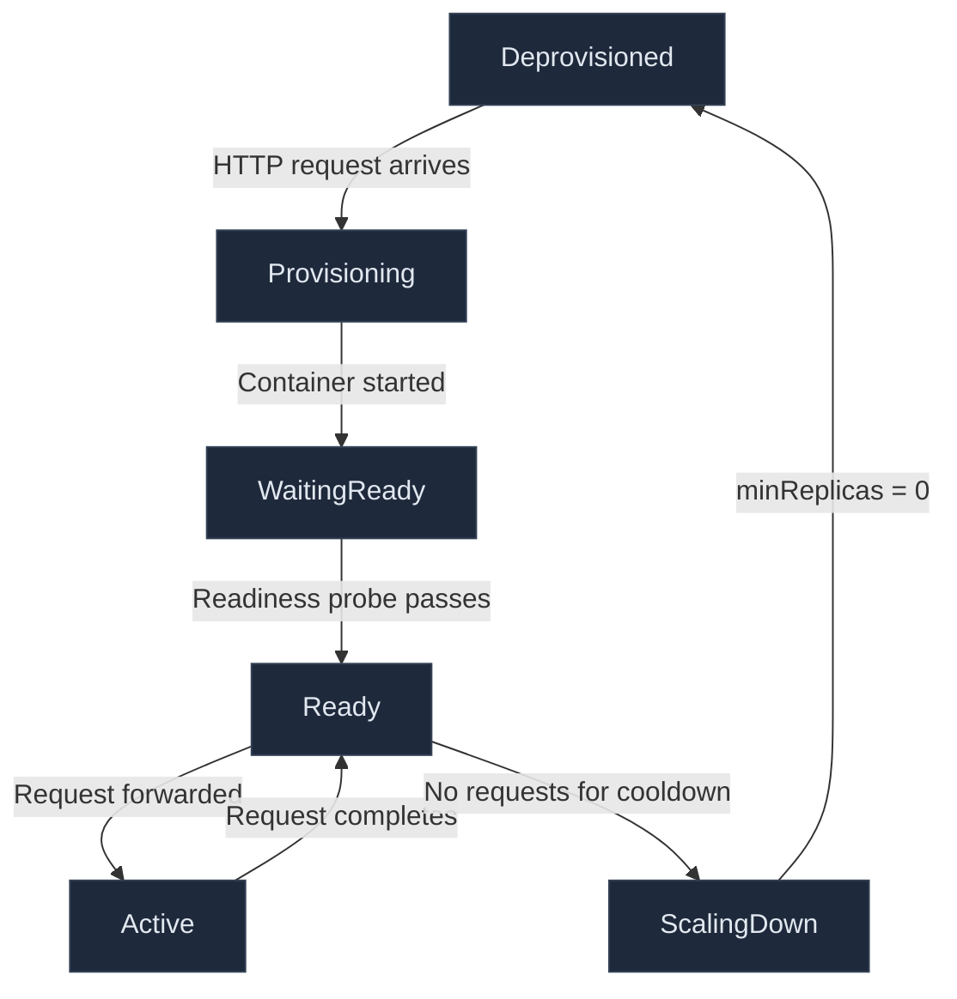

Part of the [CCDiary series](/articles/ccdiary/architecture-overview).

Azure Container Apps on the consumption plan bills per request and per vCPU-second. Setting `minReplicas: 0` means no replicas run when no traffic is in flight — which at personal-diary scale translates to a monthly compute bill that rounds to zero. The trade-off is cold starts: the first request after an idle period has to wait for a container to start. This article covers the full lifecycle, how the health probes are configured, and what the cold-start experience actually looks like.

## Scaling Architecture

Container Apps uses KEDA (Kubernetes Event Driven Autoscaler) under the hood. The HTTP trigger watches for incoming requests to the application's ingress URL. When a request arrives and no replicas are running, KEDA provisions a replica and holds the request until the container passes its readiness probe.



The KEDA HTTP add-on buffers incoming requests during the provisioning phase. The caller sees a delayed response, not an error. From the browser's perspective the request eventually completes; it just takes longer on a cold start than on a warm one.

## Bicep Configuration

The scaling and probe configuration is defined in Bicep alongside the container definition:

```bicep
template: {
  containers: [
    {
      name: 'api'
      image: 'ghcr.io/sinclapa/ccdiary-api:${apiImageTag}'
      resources: {
        cpu: '0.25'
        memory: '0.5Gi'
      }
      probes: [
        {
          type: 'Liveness'
          httpGet: {
            path: '/health/live'
            port: 8080
          }
          initialDelaySeconds: 5
          periodSeconds: 10
          failureThreshold: 3
          timeoutSeconds: 5
        }
        {
          type: 'Readiness'
          httpGet: {
            path: '/health/ready'
            port: 8080
          }
          initialDelaySeconds: 10
          periodSeconds: 5
          failureThreshold: 3
          timeoutSeconds: 10
        }
        {
          type: 'Startup'
          httpGet: {
            path: '/health/live'
            port: 8080
          }
          initialDelaySeconds: 0
          periodSeconds: 3
          failureThreshold: 20    // 20 × 3s = 60s budget for startup
          timeoutSeconds: 5
        }
      ]
    }
  ]
  scale: {
    minReplicas: 0
    maxReplicas: 1
    rules: [
      {
        name: 'http-trigger'
        http: {
          metadata: {
            concurrentRequests: '10'
          }
        }
      }
    ]
  }
}
```

Three probes, each with a different purpose:

| Probe | Endpoint | Purpose |
|---|---|---|
| Startup | `/health/live` | Suppresses liveness failures during slow startup |
| Liveness | `/health/live` | Restarts the container if the process hangs |
| Readiness | `/health/ready` | Gates traffic until the API and database are ready |

`concurrentRequests: '10'` on the HTTP scale rule means: if more than 10 requests are in flight simultaneously, scale up. Since `maxReplicas` is 1, this effectively means "if there are requests, have a replica". At personal-diary scale this threshold is never hit.

## Health Endpoints with Steeltoe

Steeltoe provides the ASP.NET Core health endpoint infrastructure with built-in checks for common Azure services.

```csharp
// Program.cs
builder.Services.AddHealthChecks()
    .AddCheck("live", () => HealthCheckResult.Healthy(), tags: ["live"])
    .AddCheck<DatabaseWarmHealthCheck>("database", tags: ["ready"])
    .AddCheck<ApiInfoHealthCheck>("api-info", tags: ["ready"]);

// Liveness — just confirms the process hasn't hung
app.MapHealthChecks("/health/live", new HealthCheckOptions
{
    Predicate = check => check.Tags.Contains("live"),
    ResponseWriter = UIResponseWriter.WriteHealthCheckUIResponse
});

// Readiness — confirms the app is ready to handle requests
app.MapHealthChecks("/health/ready", new HealthCheckOptions
{
    Predicate = check => check.Tags.Contains("ready"),
    ResponseWriter = UIResponseWriter.WriteHealthCheckUIResponse
});
```

The liveness check is intentionally minimal — a process that can respond to HTTP is alive by definition. The readiness check includes the database ping so the container is only marked ready after confirming the database is reachable.

```csharp
// Health/DatabaseWarmHealthCheck.cs
public class DatabaseWarmHealthCheck : IHealthCheck
{
    private readonly CcDiaryDbContext _db;
    public DatabaseWarmHealthCheck(CcDiaryDbContext db) => _db = db;

    public async Task<HealthCheckResult> CheckHealthAsync(
        HealthCheckContext context,
        CancellationToken cancellationToken = default)
    {
        try
        {
            await _db.Database.ExecuteSqlRawAsync("SELECT 1", cancellationToken);
            return HealthCheckResult.Healthy("Database reachable");
        }
        catch (Exception ex)
        {
            return HealthCheckResult.Unhealthy("Database unreachable", ex);
        }
    }
}
```

## Cold-Start Timing

A cold start has three phases:

**Phase 1 — Image pull**: If the image layer is cached on the node (which it usually is after the first deploy), this is near-instant. Container Apps nodes cache recently used images. A fresh node or a new image tag triggers a pull from GHCR, which for a ~200 MB image takes 5–10 seconds.

**Phase 2 — ASP.NET Core startup**: The .NET runtime initialises, middleware is registered, and the DI container is built. For the CCDiary API this takes roughly 2–4 seconds on 0.25 vCPU.

**Phase 3 — Readiness probe**: After `initialDelaySeconds: 10`, the platform starts calling `/health/ready` every 5 seconds. The first call triggers the database ping. If the database is also cold (paused), this adds 20–30 seconds while the database resumes. Once the probe passes, traffic is forwarded.

**Typical cold-start times:**

| Database state | Expected total delay |
|---|---|
| Database warm | 15–20 s |
| Database paused | 35–55 s |

These numbers are measurable from Grafana using the Faro frontend traces — the span from "request sent" to "first byte received" captures the full cold-start duration. See the [OpenTelemetry article](/articles/ccdiary/opentelemetry-end-to-end) for the Grafana query.

## Graceful Shutdown

When the scale-down decision is made, Container Apps sends SIGTERM to the process and waits for it to exit. ASP.NET Core handles SIGTERM automatically — it stops accepting new requests and waits for in-flight requests to complete before exiting.

The default graceful shutdown timeout in ASP.NET Core is 5 seconds. For a diary API this is more than enough, but it can be extended:

```csharp
builder.Services.Configure<HostOptions>(options =>
{
    options.ShutdownTimeout = TimeSpan.FromSeconds(30);
});
```

Container Apps gives the container up to 30 seconds to exit after SIGTERM. If the process is still running after 30 seconds, SIGKILL is sent. Setting the ASP.NET Core shutdown timeout to 30 seconds aligns the two.

## Ingress Configuration

The Container App is configured with external ingress on port 8080 over HTTPS. The `transport: 'auto'` setting allows Container Apps to negotiate HTTP/2 where the client supports it, falling back to HTTP/1.1.

```bicep
ingress: {
  external: true
  targetPort: 8080
  transport: 'auto'
  corsPolicy: {
    allowedOrigins: [
      'https://ccdiary.cooking-code.dev'
      'https://*.azurestaticapps.net'   // allows all preview hostnames
      'http://localhost:5173'
    ]
    allowedMethods: ['GET', 'POST', 'PUT', 'DELETE', 'OPTIONS']
    allowedHeaders: ['Authorization', 'Content-Type', 'traceparent', 'tracestate']
    allowCredentials: true
  }
}
```

`allowedHeaders` includes `traceparent` and `tracestate` — the W3C Trace Context headers that carry distributed trace IDs from the browser to the API. Without these, CORS preflight blocks the trace propagation and the frontend and backend traces cannot be joined. See the [OpenTelemetry article](/articles/ccdiary/opentelemetry-end-to-end) for details.

`https://*.azurestaticapps.net` as a wildcard origin allows all PR preview deployments to call the API without registering each preview URL individually.

## Why Not a Startup Probe?

The startup probe uses the same `/health/live` endpoint as the liveness probe but with a higher failure threshold (20 attempts × 3 seconds = 60 seconds). While the startup probe is active, the liveness probe is disabled — which prevents the container from being killed for being slow to start.

Without a startup probe, a container that takes 20 seconds to start might be killed by the liveness probe (which starts checking after 5 seconds and kills after 3 failures at 10-second intervals). The startup probe gives the container a 60-second budget to become live before normal liveness checks begin.

## Cost Reality

At personal-diary scale — a few sessions per day — the compute cost with `minReplicas: 0` is genuinely zero most months. The Container Apps consumption plan has a free grant of 180,000 vCPU-seconds and 360,000 GiB-seconds per subscription per month. A typical diary session of 10 minutes at 0.25 vCPU / 0.5 GiB uses:

- vCPU: 10 min × 60 s × 0.25 = 150 vCPU-seconds
- Memory: 10 min × 60 s × 0.5 = 300 GiB-seconds

Thirty sessions a month: 4,500 vCPU-seconds and 9,000 GiB-seconds — well within the free grant.

## What's Next

All the telemetry from Container Apps, the database, and the frontend flows to the same Log Analytics workspace. The [OpenTelemetry article](/articles/ccdiary/opentelemetry-end-to-end) shows how to join those signals into a coherent picture in Grafana.
