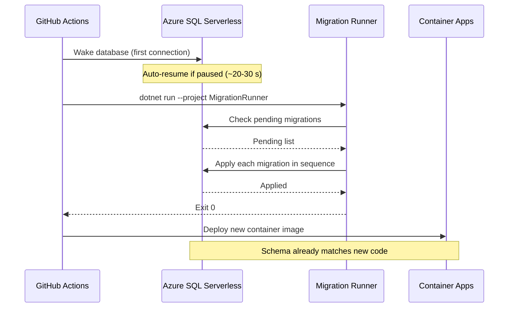

Part of the [CCDiary series](/articles/ccdiary/architecture-overview).

Azure SQL Serverless auto-pauses after 60 minutes of inactivity. When the next connection arrives, the database resumes — but that takes 20–30 seconds. EF Core migrations need the database to be awake and reachable. This article covers how CCDiary handles both: migrations as a discrete CI step with a wake-up retry, and a connection resilience policy that absorbs the cold-start latency transparently at runtime.

## The Problem with Migrations at Startup

The common pattern of running `await dbContext.Database.MigrateAsync()` at application startup has a specific failure mode with serverless SQL: if the database is paused when the container starts, the migration call fails. You could add a retry loop here, but that means:

1. Every startup blocks on a potential 30-second database wake-up
2. Failed migrations can leave the schema in a partially applied state
3. The new container image is live before the schema it expects exists

CCDiary solves this by running migrations as a separate CI step — **before** the new container image is deployed — using a dedicated migration runner. Schema and code are never out of sync.

## CI Pipeline Order



Migrations run before the container image is updated. If a migration fails, the deploy job never runs — the old container image stays live and the database remains at the previous schema version.

## The Migration Runner

A small console project lives alongside the API. It exists solely to run migrations; it has no HTTP server, no business logic.

```csharp
// src/CcDiary.MigrationRunner/Program.cs
using Microsoft.EntityFrameworkCore;
using CcDiary.Data;

var connectionString = args.FirstOrDefault()
    ?? Environment.GetEnvironmentVariable("ConnectionStrings__DefaultConnection")
    ?? throw new InvalidOperationException("No connection string provided.");

var options = new DbContextOptionsBuilder<CcDiaryDbContext>()
    .UseSqlServer(connectionString, sql =>
    {
        sql.EnableRetryOnFailure(
            maxRetryCount: 10,
            maxRetryDelay: TimeSpan.FromSeconds(30),
            errorNumbersToAdd: null);
        sql.CommandTimeout(120);  // migrations can take time on cold start
    })
    .Options;

await using var context = new CcDiaryDbContext(options);

Console.WriteLine("Checking for pending migrations...");

var pending = await context.Database.GetPendingMigrationsAsync();
if (!pending.Any())
{
    Console.WriteLine("No pending migrations.");
    return 0;
}

Console.WriteLine($"Applying {pending.Count()} migration(s): {string.Join(", ", pending)}");
await context.Database.MigrateAsync();
Console.WriteLine("Migrations applied successfully.");
return 0;
```

`EnableRetryOnFailure` is the mechanism that handles a paused database. When the first connection attempt finds the database paused, SQL Server returns error codes 40613 (database not currently available) or 40143 (connection to the database could not be established). The retry policy recognises these as transient and waits before retrying — long enough for the database to wake up.

The CI step:

```yaml
- name: Run database migrations
  run: |
    dotnet run \
      --project src/CcDiary.MigrationRunner \
      --configuration Release \
      -- "${{ secrets.SQL_CONNECTION_STRING }}"
  timeout-minutes: 5
```

The 5-minute timeout gives the database time to wake up even on a slow start. In practice, with 10 retries at up to 30 seconds each, the runner will wait up to ~300 seconds — matching the timeout.

## DbContext Configuration

The main API DbContext also configures resilience, but with more conservative settings since it handles live user requests:

```csharp
// Program.cs
builder.Services.AddDbContext<CcDiaryDbContext>(options =>
{
    options.UseSqlServer(
        builder.Configuration.GetConnectionString("DefaultConnection"),
        sql =>
        {
            sql.EnableRetryOnFailure(
                maxRetryCount: 5,
                maxRetryDelay: TimeSpan.FromSeconds(10),
                errorNumbersToAdd: null);
            sql.CommandTimeout(30);
        });

    if (builder.Environment.IsDevelopment())
        options.EnableSensitiveDataLogging();
});
```

Five retries at up to 10 seconds each: enough to absorb a brief connection hiccup but not so long that a user waits 50 seconds for a page load. If the database is paused at user-request time (which shouldn't happen in normal use — a prior request would have woken it), the request will fail after the retry budget. This is an acceptable trade-off.

## Entity and Migration Design

Entities are plain C# classes. EF Core conventions handle most of the mapping; attributes fill in the gaps.

```csharp
// src/CcDiary.Data/Entities/DiaryEntry.cs
public class DiaryEntry
{
    public int Id { get; set; }

    [Required]
    [MaxLength(200)]
    public string Title { get; set; } = string.Empty;

    [Required]
    public string Content { get; set; } = string.Empty;

    public DateTime CreatedUtc { get; set; }
    public DateTime? UpdatedUtc { get; set; }

    [MaxLength(450)]
    public string OwnerOid { get; set; } = string.Empty;  // Entra ID object ID

    public double? Latitude { get; set; }
    public double? Longitude { get; set; }

    public bool IsArchived { get; set; }
}
```

```csharp
// src/CcDiary.Data/CcDiaryDbContext.cs
public class CcDiaryDbContext : DbContext
{
    public CcDiaryDbContext(DbContextOptions<CcDiaryDbContext> options) : base(options) { }

    public DbSet<DiaryEntry> DiaryEntries => Set<DiaryEntry>();
    public DbSet<UserProfile> UserProfiles => Set<UserProfile>();
    public DbSet<AccessRequest> AccessRequests => Set<AccessRequest>();

    protected override void OnModelCreating(ModelBuilder modelBuilder)
    {
        modelBuilder.Entity<DiaryEntry>(entity =>
        {
            entity.HasIndex(e => e.OwnerOid);         // filter by owner
            entity.HasIndex(e => e.CreatedUtc);       // sort by date
            entity.Property(e => e.CreatedUtc)
                  .HasDefaultValueSql("GETUTCDATE()");
        });
    }
}
```

### Creating and Applying Migrations

Migrations are generated locally against a local SQL instance:

```bash
dotnet ef migrations add AddLocationToEntry \
  --project src/CcDiary.Data \
  --startup-project src/CcDiary.Api
```

This creates three files in `src/CcDiary.Data/Migrations/`:
- `20260501120000_AddLocationToEntry.cs` — the Up/Down methods
- `20260501120000_AddLocationToEntry.Designer.cs` — EF Core snapshot metadata
- `CcDiaryDbContextModelSnapshot.cs` — updated model snapshot

All three must be committed. The `.Designer.cs` file is generated but must be accurate — if it's missing or stale, `GetPendingMigrationsAsync()` may give wrong results.

A sample migration:

```csharp
public partial class AddLocationToEntry : Migration
{
    protected override void Up(MigrationBuilder migrationBuilder)
    {
        migrationBuilder.AddColumn<double>(
            name: "Latitude",
            table: "DiaryEntries",
            type: "float",
            nullable: true);

        migrationBuilder.AddColumn<double>(
            name: "Longitude",
            table: "DiaryEntries",
            type: "float",
            nullable: true);
    }

    protected override void Down(MigrationBuilder migrationBuilder)
    {
        migrationBuilder.DropColumn(name: "Latitude", table: "DiaryEntries");
        migrationBuilder.DropColumn(name: "Longitude", table: "DiaryEntries");
    }
}
```

Always write the `Down` method. Even if you never intend to roll back, a valid `Down` method keeps the migration history usable.

## Handling Cold-Start Latency in the API

When a user makes the first request after the database has been idle (not the same as the container being cold — the database can be paused while the container is running), the first query takes 20–30 seconds longer than normal.

EF Core's retry policy absorbs this silently for most cases. However, for latency-sensitive endpoints, there's an additional technique: a lightweight "ping" query on the health check endpoint that wakes the database as part of the Container Apps readiness probe.

```csharp
// src/CcDiary.Api/Health/DatabaseWarmHealthCheck.cs
public class DatabaseWarmHealthCheck : IHealthCheck
{
    private readonly CcDiaryDbContext _context;

    public DatabaseWarmHealthCheck(CcDiaryDbContext context)
        => _context = context;

    public async Task<HealthCheckResult> CheckHealthAsync(
        HealthCheckContext context,
        CancellationToken cancellationToken = default)
    {
        try
        {
            // Lightweight ping — no table scan
            await _context.Database.ExecuteSqlRawAsync(
                "SELECT 1", cancellationToken);
            return HealthCheckResult.Healthy();
        }
        catch (Exception ex)
        {
            return HealthCheckResult.Degraded(ex.Message);
        }
    }
}
```

```csharp
// Program.cs — register health checks
builder.Services.AddHealthChecks()
    .AddCheck<DatabaseWarmHealthCheck>(
        "database-warm",
        failureStatus: HealthStatus.Degraded,
        tags: ["ready"]);

// Map endpoints
app.MapHealthChecks("/health/live", new HealthCheckOptions
{
    Predicate = _ => false   // liveness: just confirm the process is up
});

app.MapHealthChecks("/health/ready", new HealthCheckOptions
{
    Predicate = check => check.Tags.Contains("ready")
});
```

The readiness probe (`/health/ready`) includes the database ping. When the Container Apps readiness probe passes, the container is marked ready to receive traffic — by which point the database is already awake. The first user request hits a warm database.

See the [Container Apps scaling article](/articles/ccdiary/container-apps-scaling) for the full probe configuration and how this interacts with the cold-start lifecycle.

## Deployment Sequencing in CI

The full deploy sequence in GitHub Actions:

```yaml
jobs:
  migrate:
    runs-on: ubuntu-latest
    environment: production
    steps:
      - uses: actions/checkout@v4
      - uses: actions/setup-dotnet@v4
        with:
          dotnet-version: '8.x'
      - name: Run migrations
        run: |
          dotnet run --project src/CcDiary.MigrationRunner -c Release \
            -- "${{ secrets.SQL_CONNECTION_STRING }}"
        timeout-minutes: 5

  deploy:
    needs: migrate          # only runs if migrate succeeds
    runs-on: ubuntu-latest
    environment: production
    steps:
      - name: Deploy container image
        run: |
          az containerapp update \
            --name ca-ccdiary-api-prod \
            --resource-group rg-ccdiary-prod \
            --image ghcr.io/sinclapa/ccdiary-api:${{ steps.version.outputs.tag }}
```

`needs: migrate` ensures the deploy job never runs if migrations fail. The `migrate` job gates the `deploy` job at the GitHub Actions level.

## What's Next

With migrations handled safely, the next article looks at how Container Apps manages the cold-start lifecycle when the replica count is zero — and how the health probes defined here fit into that picture: [Container Apps zero-to-one scaling](/articles/ccdiary/container-apps-scaling).
