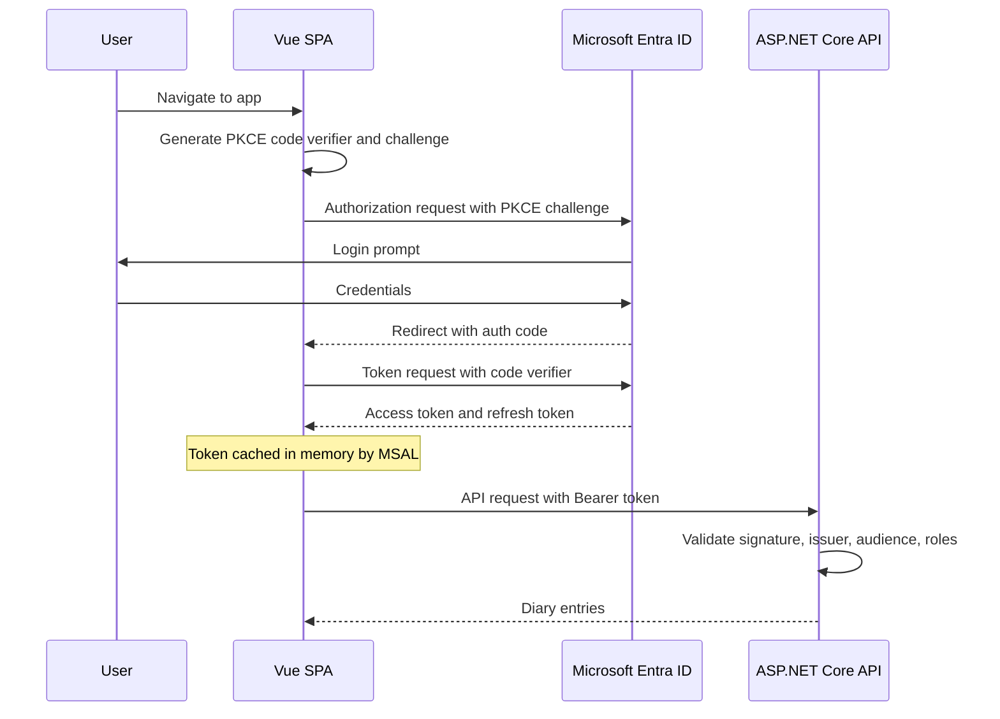
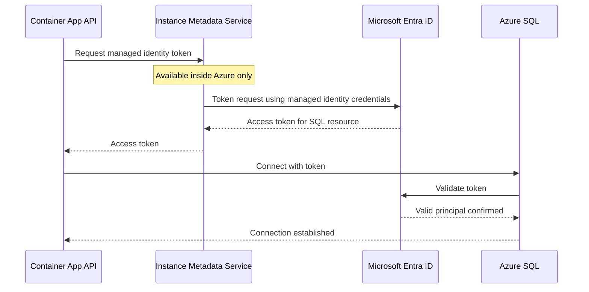

Part of the [CCDiary series](/articles/ccdiary/architecture-overview).

Authentication in CCDiary runs entirely through Microsoft Entra ID. The browser uses MSAL to obtain a JWT. The API validates that JWT and enforces role-based access. The API connects to SQL using a managed identity — no passwords anywhere in the system. This article covers each of those three integration points in detail.

## App Registrations

Two Entra ID app registrations are needed: one for the SPA and one for the API. They're separate because the SPA is a public client (it cannot hold a secret) and the API is a confidential resource server.

**API app registration** — defines the roles and exposes an API scope:

```
Application ID URI: api://<api-client-id>
App roles:
  - DiaryAdmin     (value: DiaryAdmin)
  - DiaryContributor (value: DiaryContributor)
  - DiaryViewer    (value: DiaryViewer)
Exposed scopes:
  - api://<api-client-id>/Diary.Access
```

**SPA app registration** — a public client that requests the API scope:

```
Redirect URIs:
  - https://ccdiary.cooking-code.dev  (production)
  - https://<preview>.azurestaticapps.net  (PR previews, added per PR)
  - http://localhost:5173  (local dev)
Allow public client flows: yes (for device code in tests)
API permissions: api://<api-client-id>/Diary.Access (delegated)
```

Role assignment happens at the user level in Entra ID: an admin assigns a user to `DiaryAdmin`, `DiaryContributor`, or `DiaryViewer` on the API app registration. The role then appears in the JWT `roles` claim.

## The Auth Flow

CCDiary uses the OAuth 2.0 Authorization Code flow with PKCE — the correct flow for SPAs. The implicit flow (returning tokens in the URL fragment) is no longer recommended because tokens in the URL are logged by servers and proxies.



PKCE (Proof Key for Code Exchange) prevents authorization code interception attacks. The SPA generates a random `code_verifier`, hashes it to produce `code_challenge`, and sends the challenge to Entra in the initial request. When exchanging the code for a token, it sends the original `code_verifier`. Entra verifies the hash matches — so a stolen code is useless without the verifier.

## MSAL in the Vue SPA

MSAL Browser is initialised once at app startup. The configuration reads from environment variables baked in at build time.

```typescript
// src/auth/msal.ts
import { PublicClientApplication, Configuration, LogLevel } from '@azure/msal-browser';

const msalConfig: Configuration = {
  auth: {
    clientId: import.meta.env.PUBLIC_SPA_CLIENT_ID,
    authority: `https://login.microsoftonline.com/${import.meta.env.PUBLIC_TENANT_ID}`,
    redirectUri: window.location.origin,
    postLogoutRedirectUri: window.location.origin,
  },
  cache: {
    cacheLocation: 'sessionStorage',   // not localStorage — avoids XSS token theft
    storeAuthStateInCookie: false,
  },
  system: {
    loggerOptions: {
      logLevel: import.meta.env.DEV ? LogLevel.Info : LogLevel.Warning,
    },
  },
};

export const msalInstance = new PublicClientApplication(msalConfig);
await msalInstance.initialize();

// Handle the redirect after login
await msalInstance.handleRedirectPromise();
```

`cacheLocation: 'sessionStorage'` is a deliberate security choice. `localStorage` persists across tabs and survives page refreshes, making tokens available to any XSS payload that runs in the same origin. `sessionStorage` is per-tab — a more limited blast radius.

### Acquiring Tokens

Token acquisition is wrapped in a composable so components don't deal with MSAL directly:

```typescript
// src/composables/useAuth.ts
import { msalInstance } from '@/auth/msal';
import { ref, computed } from 'vue';

const apiScopes = [import.meta.env.PUBLIC_API_SCOPE];

export function useAuth() {
  const account = ref(msalInstance.getActiveAccount());

  const isAuthenticated = computed(() => !!account.value);

  async function getAccessToken(): Promise<string> {
    const request = { scopes: apiScopes, account: account.value ?? undefined };
    try {
      // Silent first — uses cached or refreshed token
      const result = await msalInstance.acquireTokenSilent(request);
      return result.accessToken;
    } catch {
      // Falls back to redirect if silent fails (e.g. session expired)
      await msalInstance.acquireTokenRedirect(request);
      throw new Error('Redirecting for auth');
    }
  }

  async function login() {
    await msalInstance.loginRedirect({ scopes: apiScopes });
  }

  async function logout() {
    await msalInstance.logoutRedirect();
  }

  return { account, isAuthenticated, getAccessToken, login, logout };
}
```

`acquireTokenSilent` checks the MSAL cache first. If the access token is still valid it returns immediately. If it's expired but a refresh token is available, MSAL silently exchanges it. Only if that fails (session expired, consent required) does it fall back to `acquireTokenRedirect`.

### Attaching the Token to API Requests

An Axios interceptor adds the Bearer token to every outbound API request:

```typescript
// src/api/client.ts
import axios from 'axios';
import { msalInstance } from '@/auth/msal';

const apiClient = axios.create({
  baseURL: import.meta.env.PUBLIC_API_BASE_URL,
});

apiClient.interceptors.request.use(async (config) => {
  const account = msalInstance.getActiveAccount();
  if (account) {
    const result = await msalInstance.acquireTokenSilent({
      scopes: [import.meta.env.PUBLIC_API_SCOPE],
      account,
    });
    config.headers.Authorization = `Bearer ${result.accessToken}`;
  }
  return config;
});

export default apiClient;
```

## JWT Bearer Validation in ASP.NET Core

The API uses Microsoft Identity Web to validate incoming JWTs. It handles signature verification, issuer validation, audience validation, and token lifetime checking automatically.

```csharp
// Program.cs
builder.Services.AddAuthentication(JwtBearerDefaults.AuthenticationScheme)
    .AddMicrosoftIdentityWebApi(builder.Configuration.GetSection("AzureAd"));

builder.Services.AddAuthorization();
```

The configuration section:

```json
// appsettings.json
{
  "AzureAd": {
    "Instance": "https://login.microsoftonline.com/",
    "TenantId": "<tenant-id>",
    "ClientId": "<api-client-id>",
    "Audience": "api://<api-client-id>"
  }
}
```

`AddMicrosoftIdentityWebApi` configures the JWT Bearer middleware to:

- Fetch the Entra ID OIDC discovery document to get the signing keys
- Validate that the token was issued by the configured tenant
- Validate that the `aud` claim matches the API's client ID
- Reject expired tokens

### Role-Based Authorization

App roles in the JWT `roles` claim map directly to ASP.NET Core's role-based authorization:

```csharp
// Protect a controller with a specific role
[ApiController]
[Route("api/[controller]")]
[Authorize(Roles = "DiaryAdmin,DiaryContributor,DiaryViewer")]
public class DiaryController : ControllerBase
{
    // All authenticated users with any diary role can reach this controller

    [HttpDelete("{id}")]
    [Authorize(Roles = "DiaryAdmin")]   // only admins can delete
    public async Task<IActionResult> Delete(int id) { ... }
}
```

The `roles` claim is a JSON array in the JWT. Microsoft Identity Web maps it to the `ClaimsPrincipal`'s roles collection automatically, so `[Authorize(Roles = "DiaryAdmin")]` works without any custom claim mapping.

### Inspecting the Current User

Anywhere in a controller, the current user's roles and object ID are available:

```csharp
// Get the OID (object ID) — stable across tenant changes
var oid = User.FindFirst("oid")?.Value
    ?? User.FindFirst("http://schemas.microsoft.com/identity/claims/objectidentifier")?.Value;

// Check role in code rather than attribute
if (User.IsInRole("DiaryAdmin"))
{
    // admin-only logic
}
```

## Managed Identity — API to SQL

The API never holds a SQL password. Instead, the Container App is assigned a system-managed identity, that identity is granted SQL roles, and the connection string uses the managed identity authentication mode.

### How It Works



The SqlClient library handles token acquisition automatically when `Authentication=Active Directory Managed Identity` is in the connection string. The application code sees a normal `SqlConnection` and does not deal with tokens directly.

### Connection String

The connection string is set as an environment variable in the Bicep container definition:

```bicep
env: [
  {
    name: 'ConnectionStrings__DefaultConnection'
    value: 'Server=${sqlServerFqdn};Database=${sqlDatabaseName};Authentication=Active Directory Managed Identity;Encrypt=True;TrustServerCertificate=False'
  }
]
```

No username. No password. The managed identity principal is determined by Azure at runtime from the container's identity context.

### Granting SQL Roles

ARM cannot manage SQL-internal role memberships, so a post-deployment script runs in CI after the Bicep deployment:

```sql
-- Idempotent: safe to run on every deploy
IF NOT EXISTS (SELECT 1 FROM sys.database_principals WHERE name = 'ccdiary-api')
BEGIN
    -- Create the user from the managed identity (no login required)
    CREATE USER [ccdiary-api] FROM EXTERNAL PROVIDER;
END

ALTER ROLE db_datareader ADD MEMBER [ccdiary-api];
ALTER ROLE db_datawriter ADD MEMBER [ccdiary-api];
```

The user name `ccdiary-api` must match the Container App resource name — that's how SQL Server resolves managed identities to database users.

The CI step:

```yaml
- name: Grant SQL roles to managed identity
  run: |
    az sql db query \
      --server sql-ccdiary-prod \
      --database ccdiary-prod \
      --resource-group rg-ccdiary-prod \
      --query-file deploy/sql/grant-roles.sql
```

`az sql db query` uses the caller's Entra ID identity, so the CI service principal needs `db_owner` or equivalent on the database to run `ALTER ROLE`.

## PR Preview Environments and Redirect URIs

Static Web Apps creates a unique hostname for each pull request preview (e.g. `https://lively-river-abc123.azurestaticapps.net`). MSAL requires the redirect URI to be pre-registered on the app registration — a redirect to an unregistered URI is blocked.

A separate GitHub Actions workflow (`entra-cleanup.yml`) handles this automatically:

```yaml
on:
  pull_request:
    types: [opened, synchronize, closed]

jobs:
  manage-redirect-uri:
    runs-on: ubuntu-latest
    steps:
      - name: Add preview redirect URI
        if: github.event.action != 'closed'
        run: |
          PREVIEW_URL="https://${{ steps.preview-url.outputs.url }}"
          az ad app update \
            --id ${{ vars.SPA_CLIENT_ID }} \
            --add replyUrls "$PREVIEW_URL"

      - name: Remove preview redirect URI
        if: github.event.action == 'closed'
        run: |
          # Remove the URI when the PR closes
          CURRENT=$(az ad app show --id ${{ vars.SPA_CLIENT_ID }} --query replyUrls -o json)
          UPDATED=$(echo $CURRENT | jq --arg url "$PREVIEW_URL" 'del(.[] | select(. == $url))')
          az ad app update --id ${{ vars.SPA_CLIENT_ID }} --set replyUrls="$UPDATED"
```

## What's Next

With the managed identity connected to SQL, the next challenge is schema management — specifically running EF Core migrations against a database that may be paused. That's covered in the [EF Core with serverless SQL article](/articles/ccdiary/ef-core-serverless-sql).
