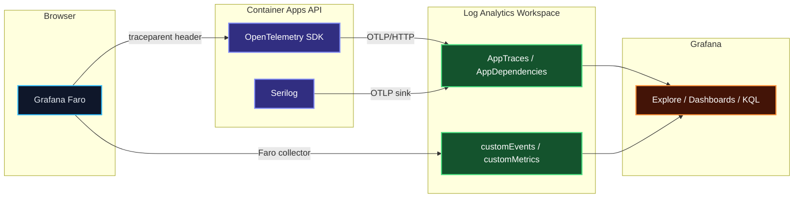

Part of the [CCDiary series](/articles/ccdiary/architecture-overview).

CCDiary has two observability layers: Grafana Faro in the Vue SPA captures browser errors, Web Vitals, and frontend traces; OpenTelemetry in the ASP.NET Core API captures HTTP request spans, database queries, and outbound HTTP calls. Both write to the same Log Analytics workspace. With W3C Trace Context propagation, a single `traceId` links a frontend user action all the way through to the SQL query that served it.

## The Signal Flow



The key to joining the two sides is the `traceparent` header. Faro generates a root span for each user navigation. When it makes an API call, it attaches `traceparent: 00-<traceId>-<spanId>-01` to the request. The API's OTEL SDK reads this header and creates a child span with the same `traceId`. Both sides now share a trace ID, so they can be queried together in Grafana.

## Backend: OpenTelemetry in ASP.NET Core

### SDK Setup

```csharp
// Program.cs
builder.Services.AddOpenTelemetry()
    .WithTracing(tracing => tracing
        .SetResourceBuilder(ResourceBuilder.CreateDefault()
            .AddService("ccdiary-api", serviceVersion: appVersion))
        .AddAspNetCoreInstrumentation(opts =>
        {
            opts.RecordException = true;
            // Don't trace health check endpoints — they're noise
            opts.Filter = ctx =>
                !ctx.Request.Path.StartsWithSegments("/health");
        })
        .AddHttpClientInstrumentation()
        .AddSqlClientInstrumentation(opts =>
        {
            opts.SetDbStatementForText = true;   // capture SQL text in dev
            opts.RecordException = true;
        })
        .AddOtlpExporter(otlp =>
        {
            otlp.Endpoint = new Uri(builder.Configuration["Otlp:Endpoint"]!);
            otlp.Headers = $"Authorization=Bearer {builder.Configuration["Otlp:AuthToken"]}";
        }))
    .WithMetrics(metrics => metrics
        .SetResourceBuilder(ResourceBuilder.CreateDefault()
            .AddService("ccdiary-api"))
        .AddAspNetCoreInstrumentation()
        .AddRuntimeInstrumentation()
        .AddOtlpExporter(otlp =>
        {
            otlp.Endpoint = new Uri(builder.Configuration["Otlp:Endpoint"]!);
        }));
```

`AddSqlClientInstrumentation` automatically instruments every `SqlCommand` executed through the `Microsoft.Data.SqlClient` driver — which is what EF Core uses. Each database query becomes a child span under the request span, showing the SQL text, duration, and any exceptions.

`SetDbStatementForText = true` captures the SQL query text in the span attributes. This is useful for debugging but should be disabled in production if queries may contain sensitive data. For CCDiary's diary entries, query parameters don't contain anything beyond diary entry IDs, so it's left enabled.

### Serilog with OTLP Sink

Structured logs from Serilog are exported through the same OTLP pipeline, keeping all signals in one place:

```csharp
// Program.cs
builder.Host.UseSerilog((ctx, services, config) =>
{
    config
        .ReadFrom.Configuration(ctx.Configuration)
        .ReadFrom.Services(services)
        .Enrich.FromLogContext()
        .Enrich.WithProperty("service.name", "ccdiary-api")
        .Enrich.WithProperty("service.version", appVersion)
        .WriteTo.OpenTelemetry(opts =>
        {
            opts.Endpoint = ctx.Configuration["Otlp:Endpoint"]!;
            opts.Headers = new Dictionary<string, string>
            {
                ["Authorization"] = $"Bearer {ctx.Configuration["Otlp:AuthToken"]!}"
            };
            opts.ResourceAttributes = new Dictionary<string, object>
            {
                ["service.name"] = "ccdiary-api"
            };
        })
        .WriteTo.Console(outputTemplate:
            "[{Timestamp:HH:mm:ss} {Level:u3}] {Message:lj}{NewLine}{Exception}");
});
```

Log entries are correlated with traces because Serilog enriches each log entry with the current `TraceId` and `SpanId` from the OTEL activity context. In Grafana, filtering by trace ID shows both the spans and the log lines from within those spans.

### W3C Trace Context Propagation

The OTEL SDK's `AddAspNetCoreInstrumentation` reads the `traceparent` header from incoming requests and uses it to parent the server-side span. No additional code is needed — the W3C propagator is the default.

For CORS to allow the header from the browser:

```bicep
corsPolicy: {
  allowedHeaders: ['Authorization', 'Content-Type', 'traceparent', 'tracestate']
  allowCredentials: true
}
```

Without `traceparent` in `allowedHeaders`, the browser's preflight OPTIONS request is blocked and Faro cannot attach the trace context.

## Frontend: Grafana Faro

Faro is initialised in `src/faro.ts` with tracing enabled:

```typescript
import { getWebInstrumentations, initializeFaro } from '@grafana/faro-web-sdk';
import { TracingInstrumentation } from '@grafana/faro-web-tracing';

initializeFaro({
  url: 'https://faro-collector-prod-gb-south-1.grafana.net/collect/<id>',
  app: {
    name: 'cooking-code',
    version: import.meta.env.PUBLIC_BUILD_VERSION,
    environment: detectEnvironment(),
  },
  instrumentations: [
    ...getWebInstrumentations({
      captureConsole: true,
    }),
    new TracingInstrumentation({
      instrumentationOptions: {
        propagateTraceHeaderCorsUrls: [
          // Tell Faro to attach traceparent to requests to these origins
          new RegExp(import.meta.env.PUBLIC_API_BASE_URL),
        ],
      },
    }),
  ],
  sessionTracking: {
    persistent: true,
    maxSessionPersistenceTime: 30 * 60 * 1000,
  },
  experimental: { trackNavigation: true },
});
```

`propagateTraceHeaderCorsUrls` is the critical option. It tells `TracingInstrumentation` which outbound URLs should have the `traceparent` header attached. Without this, Faro generates frontend-only traces that stop at the browser boundary.

### What Faro Captures

Faro instruments the browser automatically:

- **Navigation spans** — each page navigation becomes a span with Web Vitals (LCP, FID, CLS) attached
- **XHR/fetch spans** — every API call becomes a child span of the navigation span, with the `traceparent` propagated to the server
- **Console errors** — captured as span events with stack traces
- **Unhandled exceptions** — sent as error events with component context

The frontend trace for a diary page load might look like:

```
[navigation] /diary/:id                             450ms
  ├── [fetch] GET /api/diary/42                     380ms  ← spans join here
  └── [fetch] GET /api/map/tiles                     60ms
```

The `GET /api/diary/42` span on the frontend has the same `traceId` as the backend span, so they're linked.

## Log Analytics Schema

Both Faro and the OTEL exporter write to Log Analytics. The relevant tables:

| Table | Contents |
|---|---|
| `AppRequests` | HTTP request spans from ASP.NET Core |
| `AppDependencies` | Outbound HTTP + SQL spans |
| `AppTraces` | Serilog log entries |
| `AppExceptions` | Unhandled exceptions from both sides |
| `customEvents` | Faro navigation and user events |
| `customMetrics` | Faro Web Vitals |

Spans from both sides share the `operation_Id` field, which maps to the W3C `traceId`.

## Grafana Queries

### End-to-End Trace View

Join frontend and backend spans for a single trace:

```kusto
// All spans for a given traceId (paste from Faro session viewer)
let traceId = "abcdef1234567890abcdef1234567890";
union AppRequests, AppDependencies, customEvents
| where operation_Id == traceId
| project timestamp, itemType, name, duration, success, operation_ParentId
| order by timestamp asc
```

### Cold-Start Detection

Find requests that took longer than 10 seconds — likely cold starts:

```kusto
AppRequests
| where timestamp > ago(7d)
| where duration > 10000       // milliseconds
| where name !contains "health"
| project timestamp, name, duration, resultCode
| order by duration desc
| take 50
```

### Frontend Error Rate by Page

```kusto
AppExceptions
| where timestamp > ago(24h)
| where sdkVersion startswith "faro"
| extend page = tostring(customDimensions["page"])
| summarize errors = count() by page, bin(timestamp, 1h)
| render timechart
```

### Database Query Performance

```kusto
AppDependencies
| where timestamp > ago(7d)
| where type == "SQL"
| where name !contains "SELECT 1"    // exclude health pings
| summarize
    avg_ms = avg(duration),
    p95_ms = percentile(duration, 95),
    calls = count()
  by name
| order by p95_ms desc
```

### Joined Latency: Browser to Database

This query measures the time from "browser sent request" to "database returned data" by joining frontend fetch spans with backend dependency spans:

```kusto
let frontend = customEvents
| where timestamp > ago(24h)
| where name == "fetch"
| project traceId = operation_Id, fe_start = timestamp, fe_duration = todouble(customMeasurements["duration"]);

let backend = AppDependencies
| where timestamp > ago(24h)
| where type == "SQL"
| project traceId = operation_Id, be_duration = duration;

frontend
| join kind=inner backend on traceId
| project traceId, fe_start, fe_duration, be_duration, api_overhead = fe_duration - be_duration
| order by fe_duration desc
```

## Grafana Dashboard

A useful dashboard for CCDiary has four panels:

1. **Request rate** — `AppRequests | summarize count() by bin(timestamp, 5m)` as a time series
2. **Error rate** — `AppRequests | where success == false | summarize count() by bin(timestamp, 5m)`
3. **p95 response time** — `AppRequests | summarize percentile(duration, 95) by bin(timestamp, 5m)`
4. **Active sessions** — `customEvents | where name == "session_start" | summarize dcount(session_Id) by bin(timestamp, 1h)`

These four panels surface the most important operational questions for a personal app: is it up, is it fast, and is anyone using it.

## Local Development

During local development, the OTEL exporter endpoint can be pointed at a local OTEL collector (running in Docker) that writes to the console:

```yaml
# docker-compose.yml
services:
  otel-collector:
    image: otel/opentelemetry-collector-contrib:latest
    ports:
      - "4318:4318"   # OTLP/HTTP
    command: ["--config=/etc/otel-config.yaml"]
    volumes:
      - ./otel-config.yaml:/etc/otel-config.yaml
```

```yaml
# otel-config.yaml
receivers:
  otlp:
    protocols:
      http:
        endpoint: "0.0.0.0:4318"

exporters:
  debug:
    verbosity: detailed

service:
  pipelines:
    traces:
      receivers: [otlp]
      exporters: [debug]
```

Set `Otlp__Endpoint=http://localhost:4318/v1/traces` in `appsettings.Development.json` and spans appear in the collector's stdout — no Grafana account needed for local debugging.

## What the Joined View Reveals

The real value of end-to-end tracing becomes apparent when debugging a slow page load. A trace might reveal:

- Browser spent 2 ms preparing the request
- Network transit: 30 ms
- API received request, started handling: 0 ms
- SQL query `SELECT * FROM DiaryEntries WHERE OwnerOid = @p0`: 850 ms ← slow
- API serialised and returned response: 5 ms
- Browser received response: 30 ms network return

Without the joined view, the user just reports "the diary list is slow". With it, the SQL query is the obvious culprit — and the `AppDependencies` table has the full query text to investigate.

This is the architecture overview's final layer completed. All five articles together describe a working system that costs nothing to run, deploys from a single command, and has full observability from the browser to the database.
