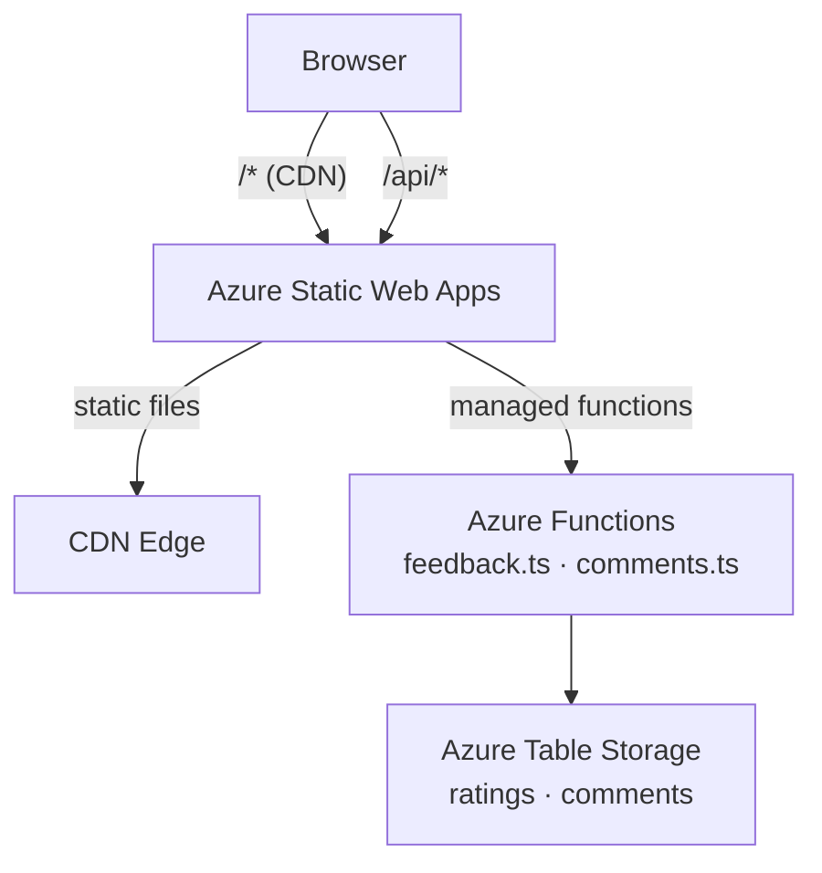
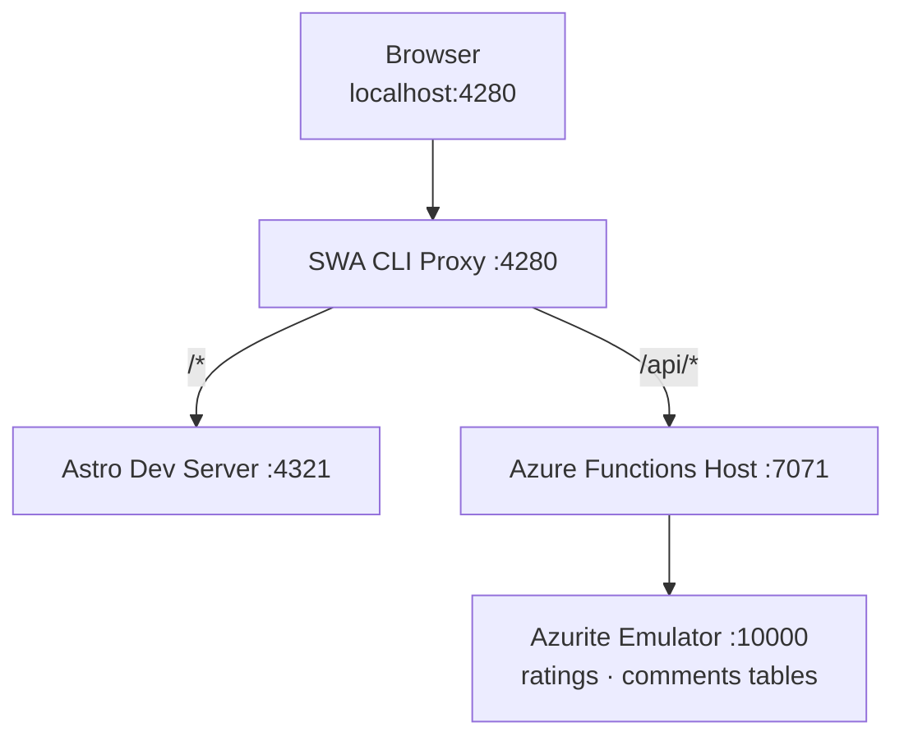

Static sites are fast and cheap to run, but the moment you want any user interaction — a simple "was this helpful?" button — you hit a wall. This post covers how I added a full feedback widget (👍 / 👎 ratings and a comment thread) to this Astro site, keeping the stack free-tier and the code fully tested.

## Objective

Every blog post and article needed:

- A **thumbs up / thumbs down** rating with visible counts
- A **comments section** — readers can submit a comment and see all approved comments
- **Zero new monthly cost** for a low-traffic blog
- **Clean environment isolation** between local dev, PR previews, and production

## The Stack

The site already runs on **Azure Static Web Apps (Free tier)**. Free tier includes managed Azure Functions — you get a real serverless backend for nothing. For storage, **Azure Table Storage** is about $0.045 per GB per month; a blog with a few thousand ratings and comments will cost fractions of a cent.

| Piece | Role | Cost |
|---|---|---|
| Azure Static Web Apps | Hosts Astro static output + routes `/api/*` to functions | Free tier |
| Azure Functions (managed) | GET/POST handlers for ratings and comments | Included in SWA Free |
| Azure Table Storage | Persists ratings and comments | ~$0/month at blog scale |
| Azurite | Local emulator for Table Storage during dev | Free |

## Architecture

### Production



### Local Development



The SWA CLI proxy is the only entry point locally — it stitches the Astro dev server and Functions host together behind a single port, exactly mirroring the production routing. Azurite is a drop-in replacement for Azure Table Storage: same SDK, same connection string format, no Azure account needed.

## Environment Isolation

The trickiest design question was keeping local, preview (per-PR), and production data separate without three separate storage accounts.

The solution is a single environment variable — `TABLE_ENV` — that controls a table name prefix:

```typescript
// api/src/tableClient.ts
const tablePrefix = process.env.TABLE_ENV === 'preview' ? 'preview' : '';

export function getTableClient(tableName: string): TableClient {
  const connectionString = process.env.AZURE_STORAGE_CONNECTION_STRING ?? '';
  return TableClient.fromConnectionString(connectionString, `${tablePrefix}${tableName}`);
}
```

| Environment | `TABLE_ENV` | Tables used |
|---|---|---|
| Local dev | `local` (or unset) | `ratings`, `comments` (Azurite) |
| PR preview | `preview` | `previewratings`, `previewcomments` |
| Production | unset | `ratings`, `comments` |

Preview environments get their own prefixed tables in the same storage account — zero bleed to production, no extra infrastructure.

## API Design

Two endpoints, four operations:

```
GET  /api/feedback?contentType=blog&slug=my-post
     → { thumbsUp: 3, thumbsDown: 1 }

POST /api/feedback
     body: { contentType, slug, rating: "up" | "down" }
     → { thumbsUp: 4, thumbsDown: 1 }

GET  /api/comments?contentType=blog&slug=my-post
     → { comments: [{ id, name, body, createdAt }] }

POST /api/comments
     body: { contentType, slug, name, body }
     → { id, name, body, createdAt }
```

Each rating or comment is stored as a Table Storage entity. The partition key is `{contentType}:{slug}` so all feedback for a post is colocated, and row keys are ISO timestamps with a random suffix for uniqueness and natural sort order.

## Table Schema

```
Table: "ratings"
  PartitionKey  "blog:my-post"
  RowKey        "2026-05-24T10:00:00.000Z_a3f2b1c4"
  rating        "up" | "down"

Table: "comments"
  PartitionKey  "blog:my-post"
  RowKey        "2026-05-24T10:05:00.000Z_d9e8f7a6"
  name          "Alice"
  body          "Great post!"
  approved      true
```

## The Function Handlers

The feedback handler is a straightforward Azure Functions v4 HTTP trigger:

```typescript
// api/src/functions/feedback.ts
import { app } from '@azure/functions';
import { getTableClient } from '../tableClient.js';

async function getCounts(contentType: string, slug: string) {
  const client = getTableClient('ratings');
  let thumbsUp = 0, thumbsDown = 0;

  for await (const entity of client.listEntities({
    queryOptions: { filter: `PartitionKey eq '${contentType}:${slug}'` }
  })) {
    if (entity.rating === 'up') thumbsUp++;
    else if (entity.rating === 'down') thumbsDown++;
  }
  return { thumbsUp, thumbsDown };
}

app.http('feedback', {
  methods: ['GET', 'POST'],
  authLevel: 'anonymous',
  handler: async (req) => {
    if (req.method === 'GET') {
      const contentType = req.query.get('contentType') ?? '';
      const slug = req.query.get('slug') ?? '';
      return { status: 200, jsonBody: await getCounts(contentType, slug) };
    }
    // POST: validate, write entity, return updated counts...
  },
});
```

The comments handler adds HTML stripping to prevent XSS from stored content:

```typescript
function stripHtml(input: string): string {
  return input
    .replace(/<(script|style)[^>]*>[\s\S]*?<\/\1>/gi, '')
    .replace(/<[^>]*>/g, '')
    .trim();
}
```

## The Client Widget

The `FeedbackWidget.astro` component is fully static markup with a client-side `<script>` island — Astro renders zero JavaScript by default, so the island pattern keeps the page fast:

```typescript
// Inside FeedbackWidget.astro <script>
import { loadFeedbackCounts, submitRating, hasVoted, markVoted } from '../utils/feedback.js';

async function initWidget(widget: HTMLElement) {
  const { contentType, slug } = widget.dataset;

  // Load counts on mount
  const counts = await loadFeedbackCounts(contentType, slug);
  upCount.textContent = String(counts.thumbsUp);

  // Restore voted state from localStorage
  if (hasVoted(slug)) {
    upBtn.disabled = true;
    downBtn.disabled = true;
  }

  upBtn.addEventListener('click', async () => {
    if (hasVoted(slug)) return;       // guard against re-vote
    upBtn.disabled = true;
    downBtn.disabled = true;
    const updated = await submitRating(contentType, slug, 'up');
    upCount.textContent = String(updated.thumbsUp);
    markVoted(slug);                  // persist to localStorage
  });
}
```

`markVoted` writes `voted:{slug}` to `localStorage`. On the next page load, `hasVoted` reads it back and disables the buttons immediately — no round-trip needed to know the visitor already voted.

## TDD Approach

All logic was written test-first with Vitest. The key challenge was mocking the Azure SDK cleanly. Mocking the relative `../tableClient` module caused path resolution issues, so both handler tests mock `@azure/data-tables` directly at the top level:

```typescript
// api/src/functions/feedback.test.ts
vi.mock('@azure/data-tables', () => ({
  TableClient: {
    fromConnectionString: vi.fn(() => ({
      listEntities: vi.fn(() => makeEntityIterator([
        { rating: 'up' }, { rating: 'up' }, { rating: 'down' }
      ])),
      createEntity: vi.fn(),
    })),
  },
}));

it('GET returns correct counts', async () => {
  const req = makeRequest('GET', { contentType: 'blog', slug: 'my-post' });
  const res = await feedbackHandler(req, makeContext());
  expect(res.status).toBe(200);
  expect(res.jsonBody).toEqual({ thumbsUp: 2, thumbsDown: 1 });
});
```

## Startup: Auto-Creating Tables

Azurite starts empty — the tables need to exist before the first request. Rather than a manual setup step, `api/src/index.ts` (the Functions entry point) creates them on startup:

```typescript
// api/src/index.ts
import './functions/feedback.js';   // registers app.http('feedback', ...)
import './functions/comments.js';   // registers app.http('comments', ...)
import { TableClient } from '@azure/data-tables';

async function ensureTables() {
  const connectionString = process.env.AZURE_STORAGE_CONNECTION_STRING ?? '';
  const prefix = process.env.TABLE_ENV === 'preview' ? 'preview_' : '';

  for (const name of ['ratings', 'comments']) {
    const client = TableClient.fromConnectionString(connectionString, `${prefix}${name}`);
    try {
      await client.createTable();
    } catch (err: any) {
      if (err?.statusCode !== 409) throw err; // 409 = already exists, that's fine
    }
  }
}

ensureTables().catch(console.error);
```

## Local Dev Automation

Running the full stack used to mean three terminal windows. Now it's one command:

```powershell
.\scripts\start-dev.ps1
```

The script starts all four services in hidden background windows, waits for each to signal readiness via its log output, then opens the browser:

```
[1/5] Azurite...              ready  [:10000]
[2/5] Building API...         done
[3/5] Astro dev server...     ready  [:4321]
[4/5] Azure Functions host... ready  [:7071]
[5/5] SWA emulator...         ready  [:4280]

All services running!
```

And to tear it all down — including any orphaned node processes that outlived their pwsh wrappers:

```powershell
.\scripts\stop-dev.ps1
```

The stop script does two passes: kills saved process tree PIDs, then kills anything still listening on the known ports (10000, 4321, 7071, 4280).

## What's Next

A few things deliberately left simple for now:

- **Vote deduplication** is localStorage-only. A signed short-lived cookie or hashed-IP approach would be more robust, but adds complexity and privacy considerations for negligible real-world benefit on a blog.
- **Comment moderation** defaults to `approved: true`. The schema supports a moderation flag — hooking it up to an admin flow would be a natural next step.
- **Spam protection** — no CAPTCHA or honeypot yet. Something to add if comments attract abuse.
